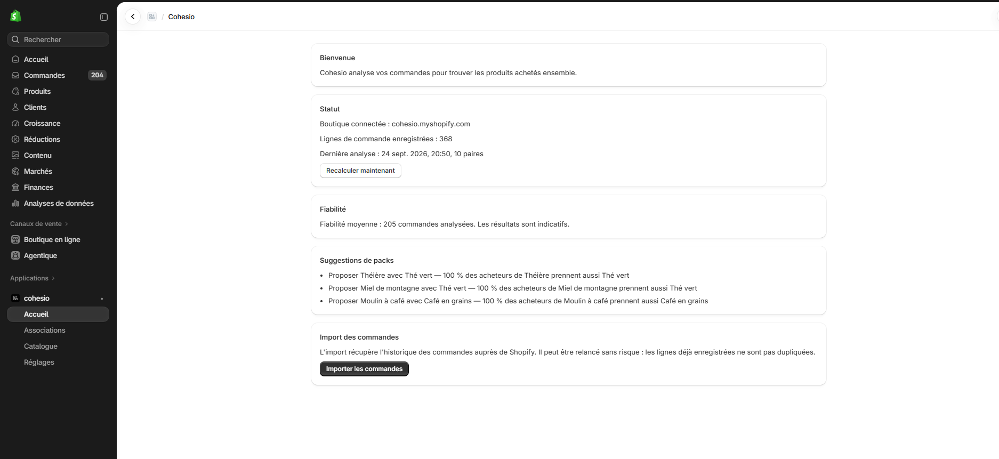
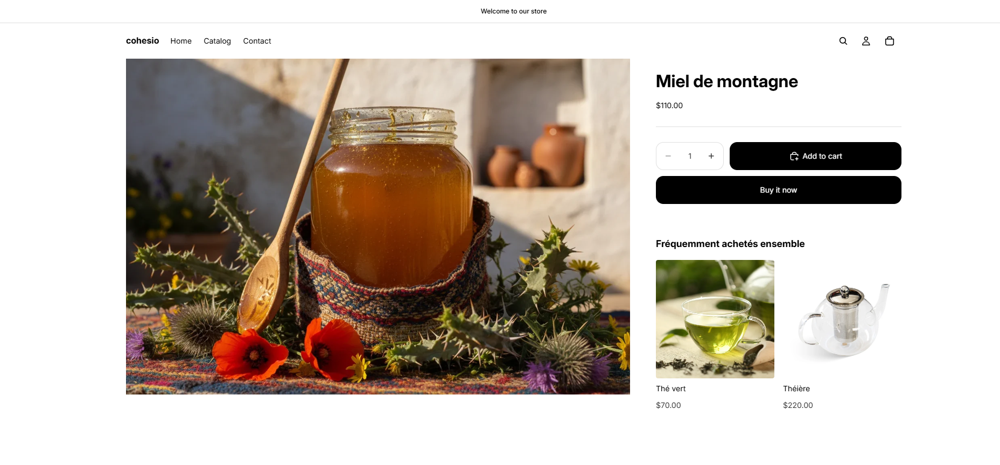
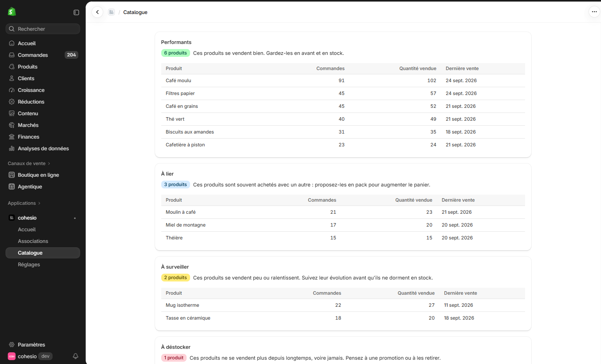
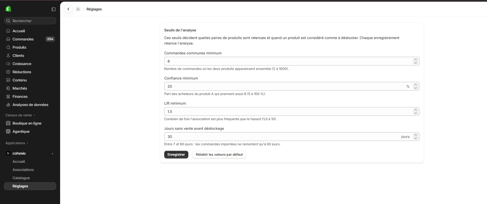
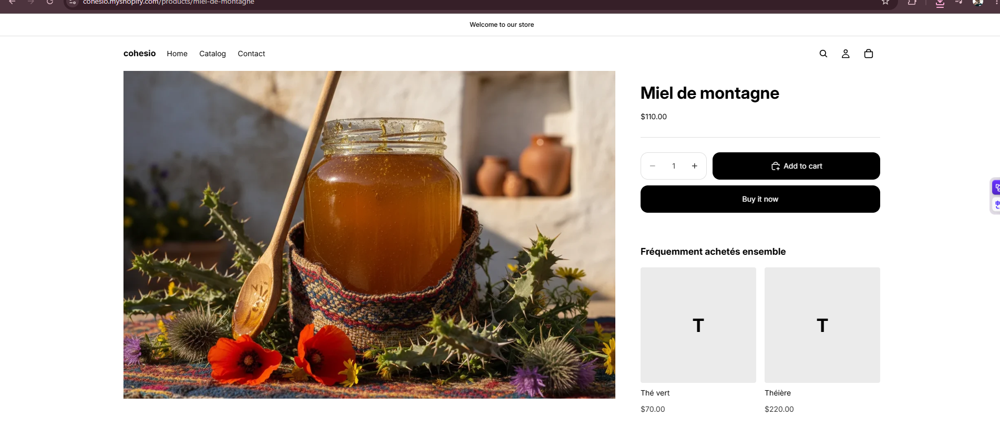
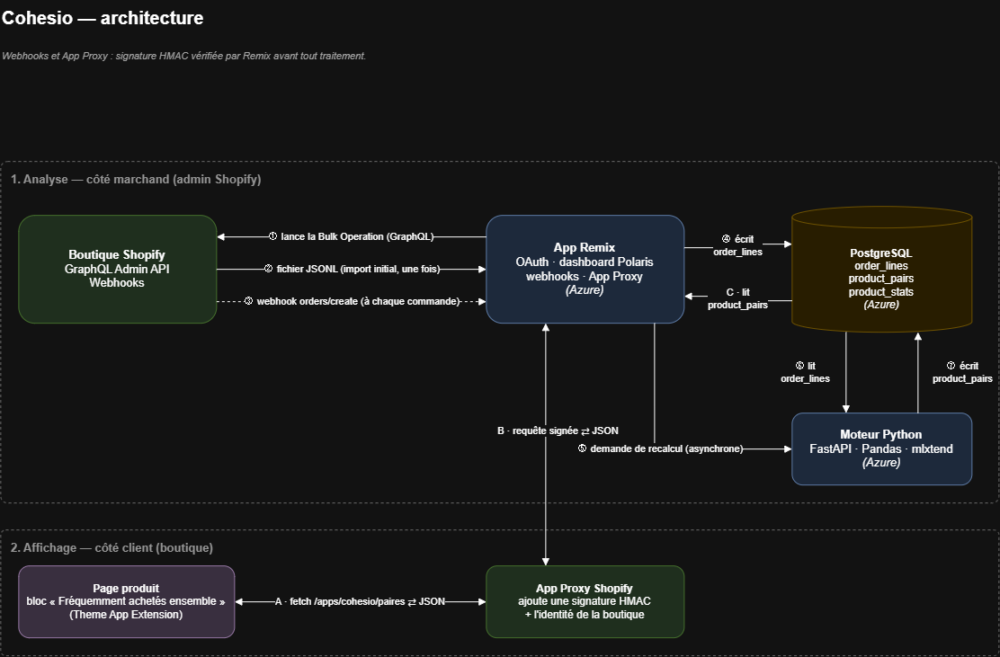

# Cohesio

Cohesio is an embedded Shopify app that analyses a store's orders to find products that are bought together, flags products that no longer sell, and shows "frequently bought together" recommendations on product pages.

**Status:** deployed on Azure, running on a Shopify development store.

> The merchant-facing interface (admin pages and storefront block defaults) is in French.

---

## What it does

- **Frequently bought together.** For every ordered pair of products A → B, the engine computes:
  - **support**: share of all orders that contain both A and B;
  - **confidence**: share of orders containing A that also contain B;
  - **lift**: confidence divided by the base rate of B. A lift above 1 means B appears with A more often than chance would predict.

  Pairs are stored in both directions (A → B and B → A), because confidence depends on direction. Only pairs that pass three thresholds are kept (see [Key decisions](#key-decisions)).
- **Dead stock.** A product is flagged *à déstocker* when it has never sold, or has not sold for `dead_days` days (30 by default). This is based on order history, not on inventory levels.
- **Product classification.** Every catalogue product, including those never sold, gets one class: *performant* (top sellers), *à lier* (weaker sellers that have a strong partner — pack candidates), *à surveiller* (weaker sellers without a partner), *à déstocker* (dead stock).
- **Storefront block.** A theme app block on product pages shows up to 3 recommended products, loaded through an App Proxy.

The admin has four pages: **Dashboard** (status, reliability, pack suggestions, order import, manual recompute), **Associations** (kept pairs with confidence, lift and order count), **Catalogue** (products grouped by class) and **Réglages** (settings: thresholds).

## Screenshots

| | |
|---|---|
| Dashboard |  |
| Associations |  |
| Catalogue |  |
| Settings |  |
| Storefront block |  |

## Architecture



Three runtime components share one PostgreSQL database:

- **App** (Node.js, React Router): OAuth, embedded admin pages, webhooks, App Proxy endpoint, order import.
- **Engine** (Python, FastAPI): reads `order_lines` and `products`, computes pairs and product stats, writes `product_pairs` and `product_stats`.
- **Theme App Extension**: the storefront block, which only talks to the app through the Shopify App Proxy.

### Journey of an order, from the store to the storefront block

1. **Initial import (once).** From the dashboard, the merchant clicks *Importer les commandes*. The app syncs the catalogue into `products`, starts a Bulk Operation on the Admin GraphQL API, polls it every 2 s, downloads the resulting JSONL file and writes one row per (order, product) into `order_lines`. It then asks the engine to recompute.
2. **New order.** Shopify sends an `orders/create` webhook. The app verifies the HMAC signature, extracts only the order id, `processed_at` and each line's product id and quantity, inserts them into `order_lines` (duplicates skipped), responds `200`, and then asks the engine to recompute without waiting.
3. **Recompute.** The engine (`POST /recompute`, authenticated with a shared key) answers `202` immediately and works in the background: it purges order lines older than 12 months, loads the shop's settings, lines and products, computes all pairs, filters them by threshold, classifies products, and replaces the shop's `product_pairs` and `product_stats` in one transaction.
4. **Storefront.** On a product page, the block's script calls `/apps/cohesio/paires?product_id=<id>`. Shopify's App Proxy forwards the request to the app with a signature and the shop identity. The app verifies the signature, reads the kept pairs where `product_a` is the current product, keeps active products only, and returns up to 3 recommendations (title, URL, image, price) as JSON. The block renders them; if there are none, it stays hidden.

## Stack

| Layer | Technology |
|---|---|
| App | Node.js, React Router 7 (Shopify app template), `@shopify/shopify-app-react-router`, TypeScript |
| Admin UI | Polaris web components, App Bridge |
| Data access (app) | Prisma 6 |
| Database | PostgreSQL |
| Engine | Python, FastAPI, Uvicorn, pandas, psycopg 3 |
| Storefront | Theme App Extension (Liquid block, vanilla JavaScript, CSS), App Proxy |
| Shopify APIs | Admin GraphQL API (Bulk Operations), webhooks |
| Tests | pytest, FastAPI `TestClient` |
| Demo data | Python scripts (`scripts/seed/`) using a separate Shopify app |
| Hosting | Azure App Service, Azure Database for PostgreSQL Flexible Server |

## Key decisions

**Bulk Operation instead of pagination for the order history.** Paginating orders with nested line items costs query cost points on every page and hits rate limits as history grows. A Bulk Operation runs the whole query asynchronously on Shopify's side and returns one JSONL file, so the import cost does not grow with the number of pages. The catalogue, which is small, is still read with regular pagination (250 products per page).

**Idempotent webhooks.** The `orders/create` handler follows a fixed order: verify HMAC → save → respond `200` → trigger the recompute asynchronously. Shopify expects a fast response and may deliver the same webhook more than once; a unique constraint on (`shop_id`, `order_id`, `product_id`) combined with `createMany({ skipDuplicates: true })` makes a replay insert nothing. The same mechanism makes the manual import safe to re-run.

**Lift, not only confidence.** Confidence alone rewards products that are popular anyway. In the demo data, *Biscuits aux amandes → Café moulu* has a confidence of 58 %, which looks strong, but Café moulu is in 44 % of all orders; the lift is only about 1.3, so biscuits barely change the odds of buying ground coffee. The minimum lift threshold (1.5) rejects this pair.

**Thresholds and a reliability indicator.** A pair is kept only if it appears in at least 8 orders, with a confidence of at least 20 % and a lift of at least 1.5. These defaults can be changed per shop on the settings page, along with the dead-stock delay (30 days by default). Because associations mean little on small samples, the dashboard shows a reliability level based on the number of distinct orders analysed: low below 100, medium from 100 to 499, good from 500.

**Rules instead of machine learning for classification.** Classification is a short, ordered set of rules: no sale within `dead_days` → *à déstocker*; order count at or above the median of sold products → *performant*; below the median with a kept pair → *à lier*; otherwise *à surveiller*. With a dozen products and a few hundred orders, a trained model would have nothing to learn from, and a merchant can understand and verify every rule.

**App Proxy for the storefront.** The storefront block cannot call the app directly without exposing an unauthenticated endpoint. Through the App Proxy, the request is served on the shop's own domain and signed by Shopify, so the app can verify it and identify the shop. The endpoint reads only the signed `shop` and `product_id` (customer parameters added by the proxy are ignored), so the response depends only on the product and is sent with `Cache-Control: public, max-age=300`.

**Theme App Extension for the block.** The block is added and positioned by the merchant in the theme editor, without editing theme code, and is removed with the app. It is restricted to product templates, has three settings (title, 2 or 3 products, show prices) and stays hidden until at least one recommendation is received.

**Separate seed app with write scopes (least privilege).** Creating demo products and orders needs write access (`productCreate`, `orderCreate`). Those permissions live in a separate app used only by the scripts in `scripts/seed/`, with the client-credentials grant. The Cohesio app itself only requests `read_orders`, `read_products` and `write_app_proxy`.

**Engine / database split, and pure functions.** `engine/analysis.py` contains only pure functions (DataFrame in, DataFrame out, current time passed as a parameter), with no database access. `engine/db.py` holds all SQL, always parameterised and filtered by `shop_id`. This lets the calculations be tested with small hand-written datasets, and keeps `order_lines` as the single source from which every result can be recomputed.

**Transactions on uninstall.** The `app/uninstalled` handler deletes the shop's sessions, order lines, products, pairs, stats and settings in one Prisma transaction: all or nothing, and a failure lets Shopify retry. Sessions are deleted first. When the engine saves results, it locks the shop's session row (`SELECT … FOR SHARE`) inside its own transaction and writes nothing if the session no longer exists; this prevents a recompute running during uninstall from re-creating data after deletion.

**UTC storage.** All timestamps are stored in UTC without time zone (Prisma's convention), and the engine uses the same convention when computing "now" and `computed_at`. The engine's status API adds an explicit `Z` suffix, and the admin converts dates to the browser's time zone only on the client.

## Security & privacy

- **Protected customer data, level 1.** Cohesio reads orders but none of the four identifying fields.
  - Fields read: order id, `processedAt`, and for each line item the product id and quantity (Bulk Operation query and webhook handler).
  - Never requested, stored or logged: `customer`, `email`, `phone`, `shippingAddress`, `billingAddress`.
- **HMAC verification.** Webhooks and App Proxy requests are verified before any processing. Manual checks on the webhook endpoint: a request without Shopify headers returns `400`; a request with a forged signature returns `401`.
- **Engine authentication.** The engine's `/recompute` and `/status` endpoints require an `X-Engine-Key` header, compared in constant time; missing or wrong keys return `401` (covered by tests).
- **Deletion on uninstall.** All data for the shop is deleted in a single transaction (see above).
- **Retention.** Order lines older than 12 months (365 days) are purged at each recompute.
- **Secrets.** Stored in Azure App Service application settings, never in the repository; `.env` files are git-ignored. Development and production use distinct keys.
- **Database.** Azure PostgreSQL firewall restricts incoming connections, and connections use SSL.
- **Storefront script.** Only relative `/products/…` URLs returned by the API are rendered, and content is inserted with `textContent`, not HTML.

## Results on demo data

The demo store has 12 products and 204 orders (366 order lines) spread over about 55 days. Orders were generated by `scripts/seed/create_orders.py` from known scenarios: ground coffee with paper filters, coffee beans with a grinder, green tea with a teapot and/or honey, miscellaneous baskets, and almond biscuits added independently to 20 % of orders.

With default thresholds, the engine keeps **10 rows (5 pairs, each in both directions)** out of 48 candidate rows:

| Product A | Product B | Orders with A and B | Support | Confidence | Lift |
|---|---|---:|---:|---:|---:|
| Théière | Miel de montagne | 8 | 3.9 % | 53.3 % | 6.40 |
| Miel de montagne | Théière | 8 | 3.9 % | 47.1 % | 6.40 |
| Thé vert | Miel de montagne | 17 | 8.3 % | 42.5 % | 5.10 |
| Théière | Thé vert | 15 | 7.4 % | 100.0 % | 5.10 |
| Miel de montagne | Thé vert | 17 | 8.3 % | 100.0 % | 5.10 |
| Thé vert | Théière | 15 | 7.4 % | 37.5 % | 5.10 |
| Moulin à café | Café en grains | 21 | 10.3 % | 100.0 % | 4.53 |
| Café en grains | Moulin à café | 21 | 10.3 % | 46.7 % | 4.53 |
| Filtres papier | Café moulu | 44 | 21.6 % | 100.0 % | 2.27 |
| Café moulu | Filtres papier | 44 | 21.6 % | 48.9 % | 2.27 |

The four generated associations are all found. *Théière ↔ Miel de montagne* was not generated directly: both products are only sold in the green-tea scenario, so they co-occur through Thé vert.

**Rejected false positive.** Almond biscuits were added at random, independently of the basket, so any association involving them is noise. *Biscuits aux amandes → Café moulu* reaches 18 common orders and a confidence of 58.1 %, above both the count and confidence thresholds. But Café moulu is the best-selling product (90 of 204 orders, 44 %), so the lift is only 1.32: the biscuits add little beyond Café moulu's base rate. The lift threshold of 1.5 rejects it. The pair with the highest lift for biscuits (*Tasse en céramique*, 1.83) is rejected for the opposite reason: only 5 common orders and a confidence of 16 %.

Resulting classification: 6 *performant*, 3 *à lier* (Théière, Miel de montagne, Moulin à café), 2 *à surveiller* (Tasse en céramique, Mug isotherme), 1 *à déstocker* (Poster café vintage, never sold). With 204 orders, the dashboard reports medium reliability.

## Tests

`engine/tests/` contains **18 pytest tests**:

| File | Tests | What they cover |
|---|---:|---|
| `test_analysis.py` | 7 | Confidence in both directions, lift value, lift below 1, lift symmetry, a never-sold product classified as dead stock, filtering by minimum order count — on a hand-computed 7-order dataset |
| `test_api.py` | 7 | Health check; `/recompute` without key, with a wrong key, with the right key (`202`); a request during a running recompute is queued; several queued requests trigger exactly one extra run; a failed recompute still releases the shop |
| `test_settings.py` | 2 | Default thresholds when a shop has no settings (query filtered by `shop_id`); custom settings are passed to the filter and classification |
| `test_retention.py` | 2 | Against a real PostgreSQL database, inside a transaction rolled back at the end: results are not written for an uninstalled shop; the purge deletes only lines older than 365 days, and only for the given shop. Skipped if the database is unreachable |

```bash
cd engine
python -m pytest
```

The app (TypeScript) has no automated tests; the HMAC checks described above were done manually.

## Deployment

| Resource | Service | Tier |
|---|---|---|
| App (React Router) | Azure App Service | B1 |
| Engine (FastAPI) | Azure App Service | B1 |
| Database | Azure Database for PostgreSQL Flexible Server | B1ms |

- Cost: about 13 USD per month, with a budget alert.
- `orders/create` webhook response time: 89 ms in production, versus about 4 s in development.
- The Theme App Extension and app configuration are deployed with `shopify app deploy`.

## Known limitations

- **60 days of order history.** The `read_orders` scope only gives access to the last 60 days of orders. Older history would need `read_all_orders`, which must be requested separately from Shopify.
- **Synthetic demo data.** The demo orders were generated by a script, and the default thresholds were tuned knowing which associations were planted. Results on a real store would need their own validation.
- **Access token not yet encrypted at rest.** The Shopify access token is stored in the `Session` table as provided by the template's Prisma session storage. Application-level encryption is planned.
- **In-memory recompute lock.** The engine tracks running and pending recomputes in process memory, which is only correct with a single engine instance.
- **No bundle creation yet.** Pack suggestions are shown to the merchant, but the app does not create bundles in Shopify.
- **Products without images.** The demo products have no images; the storefront block shows a placeholder with the product's initial.

## Run locally

### Prerequisites

- Node.js 20.19+ (or 22.12+)
- Python 3.10+ (developed with 3.14)
- PostgreSQL
- [Shopify CLI](https://shopify.dev/docs/apps/tools/cli), a Shopify Partner account and a development store
- For demo data only: a second Shopify app installed on the development store, with `write_products` and `write_orders`

### Environment

[`.env.example`](.env.example) lists every variable without values. Create three files from it:

- `.env` (app): `DATABASE_URL`, `ENGINE_URL` (e.g. `http://localhost:8000`), `ENGINE_API_KEY`
- `engine/.env`: `DATABASE_URL`, `ENGINE_API_KEY` (same key as the app)
- `scripts/seed/.env` (optional): `SHOPIFY_SHOP`, `SHOPIFY_CLIENT_ID`, `SHOPIFY_CLIENT_SECRET` of the seed app

The committed `shopify.app.toml` points to the production deployment. For local development, link your own app configuration first with `shopify app config link`.

### Engine

```bash
cd engine
python -m venv .venv
.venv/Scripts/activate        # Windows; use `source .venv/bin/activate` on macOS/Linux
pip install -r requirements.txt
uvicorn api:app --port 8000
```

### App

```bash
npm install
shopify app dev
```

`shopify app dev` generates the Prisma client and applies migrations before starting (see `shopify.web.toml`). Open the app in the development store admin and click *Importer les commandes* on the dashboard.

### Demo data (optional)

```bash
cd scripts/seed
python create_products.py
python create_orders.py --dry-run
python create_orders.py
```

`--dry-run` prints the generated baskets and expected confidences without calling Shopify. Order creation is throttled (13 s between orders) and resumes where it stopped (`orders_progress.json`).

To run the engine once from the command line and print its results: `python run.py --shop <store>.myshopify.com` in `engine/`.

## Author

Mohamed Amine Attouchi
